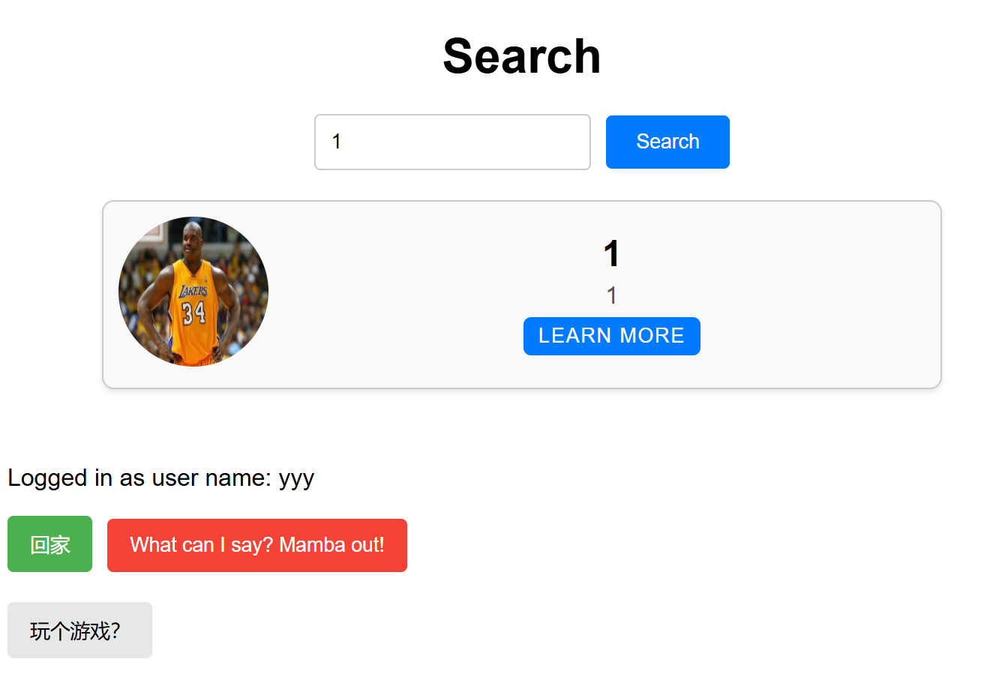

# 用户手册

平台地址：[chating app](https://front-end-test-kobebryant.app.secoder.net/)

## 注册与登录

### 注册新用户

输入用户名、密码、电话、邮箱、个性签名并选择头像后进行注册，信息未完整填写时会有红色小字“信息不完整哦”进行提示

### 登录

* 输入已注册用户的用户名以及密码进行登录，密码错误会提示"wrong password"
* 如果不小心点进login，但是并没有注册账户，可以通过点击“go to register”按钮进入注册界面

## 用户信息管理

### 个人主页

登陆成功后，进入如下所示的个人主页，需要注意的是

* 在任何页面点击左下角的“回家”绿色按钮均可跳转到本用户的个人主页
* 在任何页面点击左下角的红色按钮均可实现用户的登出

### 修改信息

用户登录后进入到个人主页，点击第一行蓝色方框“啥？你要改信息？”可以修改用户的个人信息，此时需正确填写本用户的用户名以及密码才能成功修改用户信息

### 注销账户

点击主页第二行的“你要删除账户？”红色方框，可以进行删除账户操作，此操作同样需要正确输入当前帐户的用户名、密码方可成功执行

## 好友管理

### 用户查找

* 点击绿色的“搜搜别人”按钮进入搜索页面，需要输入完整且正确的用户名进行检索
* 搜到的选项将会在下面列出

  
* 点击learn more可以进入该用户的个人主页并查看个人信息，还可以申请添加该用户的好友

  
* 如果该用户已经是好友则可以选择删除好友以及跟他聊天

### 好友申请

* 通过搜索或者通过打开群聊信息界面点击某用户名片后进入该用户个人主页进行好友申请
* 被申请的用户点击“好友列表”->“查看新的好友请求”并针对该申请点击“Add Friend”来通过好友请求

  
* 可在好友列表界面查看已经发送但是没有通过的好友请求以及好友分组。

### 好友列表

点击主页上的“好友列表”按钮进入好友列表界面，可以新增好友分组以及查看好友分组列表

## 会话功能

### 私聊会话

可以通过两种方法进入私聊会话

* 点击“好友列表”，点击好友的头像并选择“聊天”

  
* 点击“会话列表”，选择好友并点击聊天

  

进入私聊会话后可以给对方发送信息，辅助信息中包括发送时间、被回复次数

对方的会话列表中会显示未读信息的数目

聊天功能

鼠标悬浮在聊天气泡上，可选择回复和删除

* 回复功能  
    可任意选择一条信息进行回复，此聊天气泡中额外显示其回复的信息，点击浅蓝色的方框可以跳转到对应信息位置。同时被回复信息的被回复次数也会相应地改变

* 删除功能
  可选择信息进行删除，但这条信息仅会从自己的聊天记录中删除，对方的聊天记录不受影响
* 搜索功能
  点击右下角的蓝色圆圈可对聊天记录进行搜索，且有按照用户搜索和按照时间搜索两种模式
  
  符合要求的信息将在搜索列表中被展示出来

### 群聊会话

#### 群聊管理

##### 创建群聊

任意用户可以点击个人主页中的“群聊列表”，然后点击新建群聊，便可以设置群聊名称，并且勾选自己的好友来创建群聊

##### 普通成员

* 普通成员可以在群聊信息界面点击其他成员头像来查看成员信息
* 可以点击“邀请好友”，填写申请内容后即可来选择自己的好友邀请进群，经群主或者管理员通过后即可加入群聊
* 可以查看群公告

在普通成员的基础上，管理员和群主具有一些额外的功能

##### 群主

群主可以点击群聊，选择群聊信息，进入群聊信息界面。点击群内成员的头像，可以进行以下操作

* 查看群成员信息
* 设为管理员/罢免（如果该成员不是/是管理员）
* 转让群主
* 踢出

此外群主还可以在群聊信息界面点击“编辑”来编辑发布群公告，发布后其他成员均可以在群聊信息界面查看群公告

群主可以点击“审核邀请”来查看邀请他人入群的申请，选择通过后对应用户即可入群

##### 管理员

* 管理员可以点击普通成员的头像并选择“踢出”来将其踢出群聊
* 管理员也可以点击“审核邀请”来通过邀请他人入群的申请

#### 群聊聊天

此部分和私聊会话部分的功能几乎完全一样，同样可以实现以下功能

* 回复信息
* 删除信息
* 搜索信息

具体使用可以参照私人会话部分
